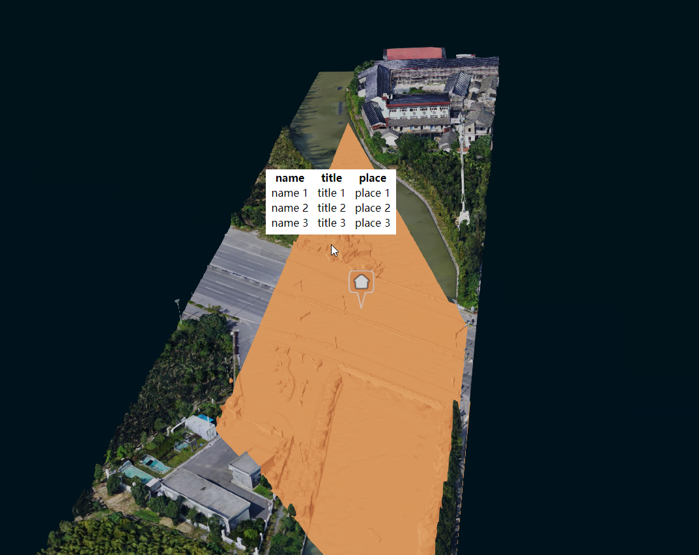

# chika-cesium

 [](https://codecov.io/gh/zy410419243/chika-cesium) [](https://greenkeeper.io/)

A model loader using cesium, with some trick functions.

## Screenshots



## Usage

```js
import { Trunk } from '..';

new Trunk('root', options);
```

For more detail, you can check [here](./src/demo/index.ts).

## API

### options

```jsx
type PointType = 'pin' | 'text' | 'none' | undefined;
type PolygonItem = {
  dataSource: Array<{
    lng: number,
    lat: number,
  }>,
  name?: string,
  id?: string,
  color?: string,
  type?: PointType,
};
```

| name       | description                                                                                                                                                                               | type                              | default |
| ---------- | ----------------------------------------------------------------------------------------------------------------------------------------------------------------------------------------- | --------------------------------- | ------- |
| dev        | notice your console when set to true, it will output coordinate infos                                                                                                                     | boolean                           | false   |
| pointDatas | draw pinners in the scene, notice that if data item contains prop `name`, it would draw a pinner with text of `name`, or it would draw using [icons](https://labs.mapbox.com/maki-icons/) | Array<{}: PolygonItem>            | []      |
| modelPaths | load models with paths, notice that this prop is null, it wouldn't show anything. Emmmm...maybe                                                                                           | Array<paths: string>              | []      |
| polygon    | draw polygons with coordinates                                                                                                                                                            | Array<{}: PolygonItem>            | []      |
| onClick    | when you click your entities, this function would be called                                                                                                                               | (pick.id, position, pick) => void | -       |
| onHover    | when you hover on your entities, this function would be called                                                                                                                            | (pick.id, position, pick) => void | -       |

Note `PolygonItem`:

if you want to draw pin on polygon, you should pass prop `id`,

and in other case like drawing `text`, you should pass props both `id` and `name`,

`name` for text showing in pin, and `id` will be passed back in callback like `onClick`

## Development

```
npm install

npm start
```

## Example

http://localhost:9099/

## Test Case

```
npm test
```

## Coverage

```
npm run coverage
```
